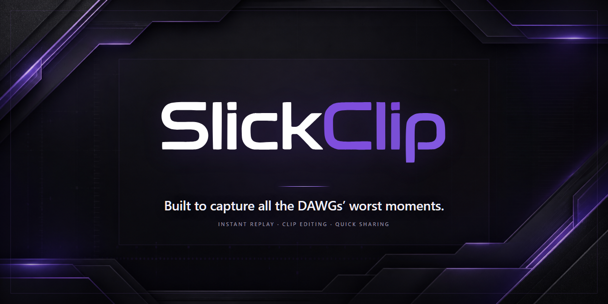

<p align="center">
  
</p>

<p align="center"><strong>Built to capture all the DAWGs’ worst moments.</strong></p>

SlickClip is a local Windows instant replay and clip editing app for keeping the moments that happen before you think to hit Record. It combines a rolling capture buffer, independent audio sources, a persistent clip library, and nondestructive editing in one focused desktop workflow.

No account, subscription, watermark, OBS installation, or separate FFmpeg setup is required for end users.

## What SlickClip does

- Captures Replay video from the selected physical display through SlickClip's bundled FFmpeg `ddagrab` backend; separate Watch Party sources remain on their isolated Windows capture path.
- Keeps a configurable rolling Replay Buffer and saves the previous window on demand.
- Records game, voice chat, and microphone audio as independently adjustable sources.
- Organizes local clips with search, Favorites, Collections, playback history, and storage protection.
- Trims, splits, mixes, and exports clips without modifying the source master.

> **Release status:** SlickClip 1.0.3 is the validated private friends build. It is unsigned, so Windows may show an Unknown Publisher or SmartScreen warning. A production signed-updater release remains gated on the requirements documented in [`docs/RELEASE_GATE.md`](docs/RELEASE_GATE.md).

## Development

Prerequisites for source development are Node.js, Rust, the Windows SDK/build tools, and PowerShell. End users install the generated Windows package and do not need these tools, OBS, or a separate FFmpeg installation.

```powershell
npm install
npm run test
npm run build
Set-Location src-tauri
cargo check
cargo test -- --nocapture
```

## Windows installer

The canonical unsigned local bundle command is:

```powershell
npm run bundle
```

It checksum-verifies and stages the pinned Windows x64 FFmpeg/ffprobe sidecars, builds the release application, and creates:

`src-tauri\target\release\bundle\nsis\SlickClip_1.0.3_x64-setup.exe`

The generated dependency files under `src-tauri\binaries` are intentionally ignored by Git. The archive, extracted executables, license, and source notice are all verified or generated by `scripts\prepare-ffmpeg.ps1`. Release artifacts remain unsigned until the Stage 26 signing credentials and release feed are configured.

The fail-closed signed release workflow is `npm run bundle:release`. It requires updater trust inputs and a real Windows signing command, verifies both signature systems, and generates the feed manifest. See `docs\RELEASE_PROCESS.md`; never substitute placeholder keys or publish the unsigned local bundle.

## User data

SlickClip stores permanent clips under `Videos\SlickClip\Clips` and application metadata under its per-user LocalAppData directory. On first launch after the final branding migration, the app moves historical `JustIn Replay` data without overwriting conflicts and rewrites Library/cache paths transactionally where applicable.

Never test migration, cleanup, install, upgrade, or uninstall against irreplaceable clips without a backup. The exact release and manual-validation gates are maintained in `docs\RELEASE_GATE.md` and `docs\MANUAL_VALIDATION_PENDING.md`.
